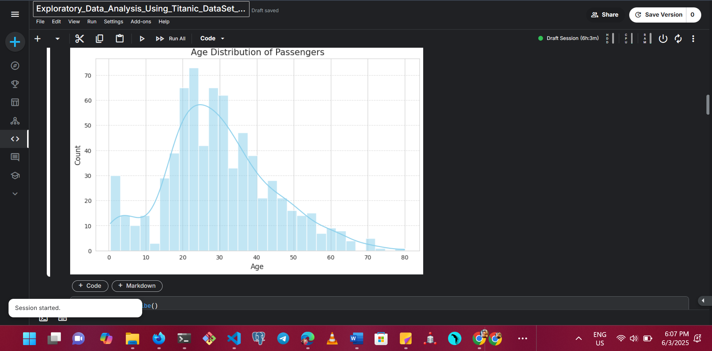
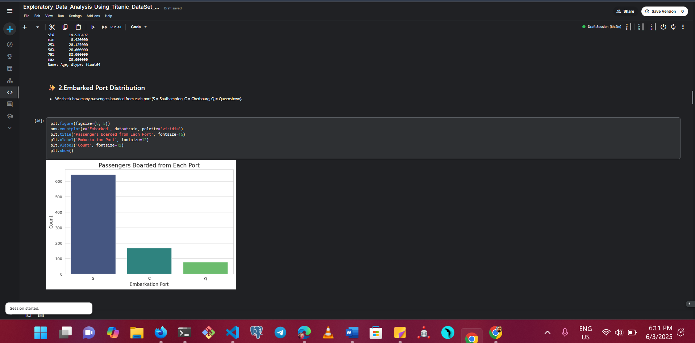
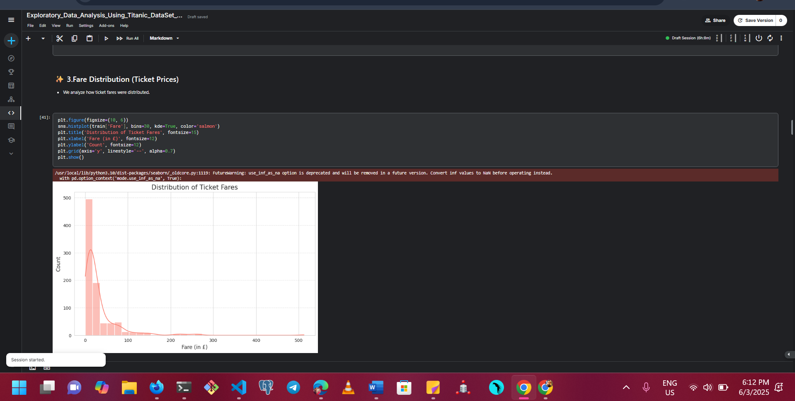
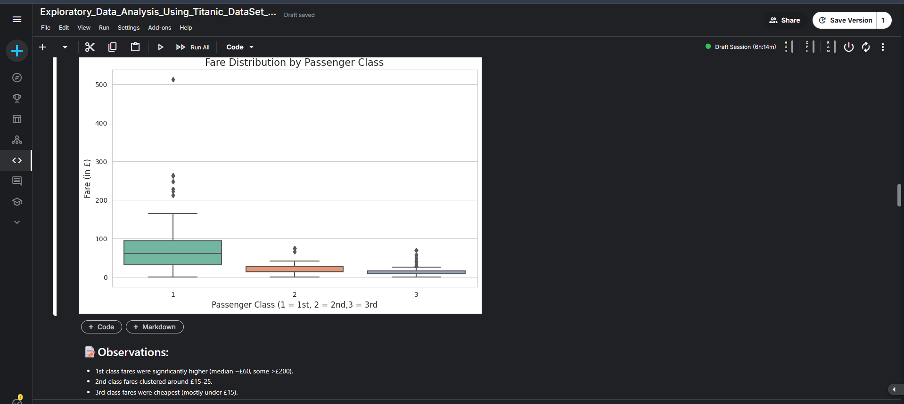
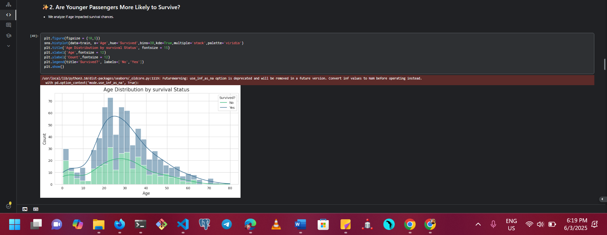
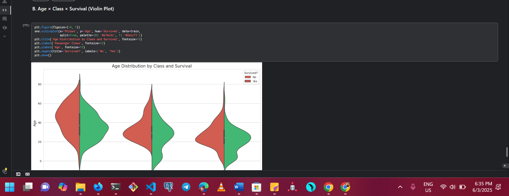
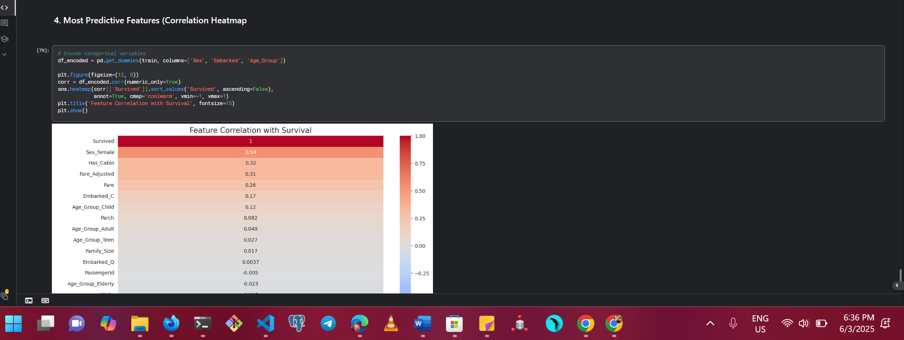

# EXPLORATORY-DATA-ANALYSIS-USING-TITANIC-DATA-SET
<!-- Language & Tools -->

<!-- Data Source -->

<!-- License -->

<!-- Status -->
)

##Project Description

An Exploratory Data Analysis (EDA) of the Titanic dataset to uncover patterns, visualize key features, and understand survival factors using Python (Pandas, Seaborn, Matplotlib).

## 📑Table of Contents
- [Introduction](#introduction)
- [Loading the Dataset](#loading-the-dataset)
- [Dataset Overview](#dataset-overview)
- [Checking for Missing Values](#checking-for-missing-values)
- [Handling Missing Values](#handling-missing-values)
- [Data Cleaning](#data-cleaning)
- [Univariate Analysis](#univariate-analysis)
- [Bivariate Analysis](#bivariate-analysis)
- [Multivariate Analysis](#multivariate-analysis)
- [Survival Rate Analysis](#survival-rate-analysis)
- [Conclusion](#conclusion)
  
## Sample Visualization

## 🚀 Live Notebook on Kaggle

You can view and run the full analysis notebook on Kaggle:
---

